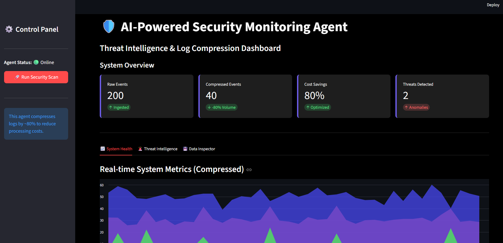

# 🛡️ AI-Powered Security Monitoring Agent



## Overview

This project implements an intelligent cybersecurity agent designed to optimize threat detection workflows. By compressing system logs before analysis, the agent significantly reduces computational overhead and storage costs while maintaining the ability to detect critical anomalies.

Traditional SIEM (Security Information and Event Management) systems often struggle with the sheer volume of raw logs. This agent addresses that challenge by:

1.  **Ingesting** raw system metrics (CPU, Memory, Network).
2.  **Compressing** data via intelligent aggregation (downsampling).
3.  **Detecting** anomalies on the compressed stream using Unsupervised Learning (Isolation Forest).
4.  **Visualizing** the cost savings and threats via a real-time dashboard.

## Features

### 1. Log Compression & Cost Optimization

- **Mechanism**: Aggregates high-frequency log data into meaningful time windows.
- **Benefit**: Reduces the data volume passed to the ML model by ~80% (configurable), directly lowering processing costs.

### 2. Anomaly Detection

- **Algorithm**: Uses `IsolationForest` from Scikit-learn.
- **Capability**: Identifies outliers in system behavior (e.g., CPU spikes, memory leaks, network surges) even within compressed data.

## Dashboard Walkthrough

The interactive dashboard allows you to visualize the agent's performance in real-time.

### ⚙️ Control Panel (Sidebar)

- **Run Security Scan**: Triggers the end-to-end pipeline:
  1.  Generates synthetic system logs (CPU, Memory, Network).
  2.  Compresses the data to reduce volume.
  3.  Runs the Isolation Forest model to detect anomalies.

### 📊 System Overview (Metrics)

- **Raw Events**: Total number of log entries ingested.
- **Compressed Events**: Number of data points after aggregation.
- **Cost Savings**: Percentage reduction in data volume (processing cost).
- **Threats Detected**: Count of anomalies identified by the AI model.

### 🔍 Analysis Tabs

1.  **System Health**: Visualizes the compressed metric trends (CPU, Memory, Network) over time.
2.  **Threat Intelligence**: Lists specific alerts with context on _why_ a data point was flagged.
3.  **Data Inspector**: Side-by-side comparison of the raw data vs. the optimized compressed data.

## Tech Stack

- **Python 3.8+**
- **Pandas**: Data manipulation and time-series aggregation.
- **Scikit-learn**: Machine learning for anomaly detection.
- **Streamlit**: Frontend visualization.

## Project Structure

- `app.py`: The main frontend dashboard application.
- `log_collector.py`: Simulates real-time system log generation with synthetic anomalies.
- `log_compressor.py`: Handles the logic for downsampling and data reduction.
- `anomaly_detector.py`: Contains the Isolation Forest model logic.
- `main.py`: CLI entry point for headless execution.

## Installation & Usage

1. **Install Dependencies**

```bash
pip install -r requirements.txt
```

2. **Run the Dashboard (Recommended)**
   Launch the interactive web interface to see the compression and detection in action.

```bash
# Using the helper script
python run_dashboard.py

# OR directly via Streamlit
streamlit run app.py
```

3. **Run in CLI Mode**

```bash
python main.py
```
